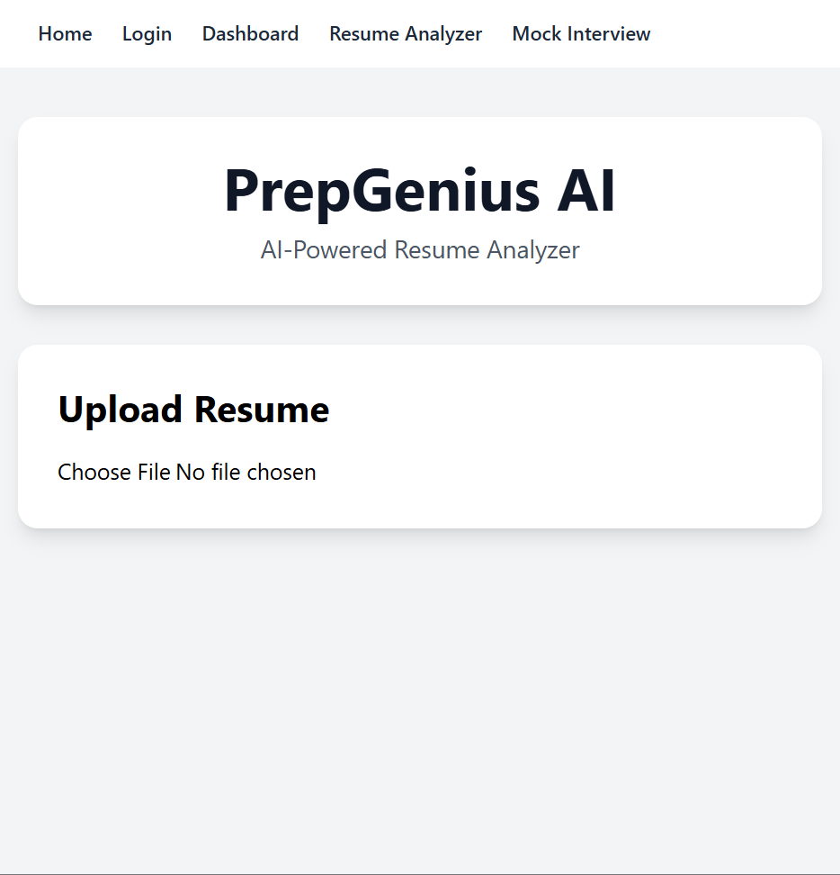
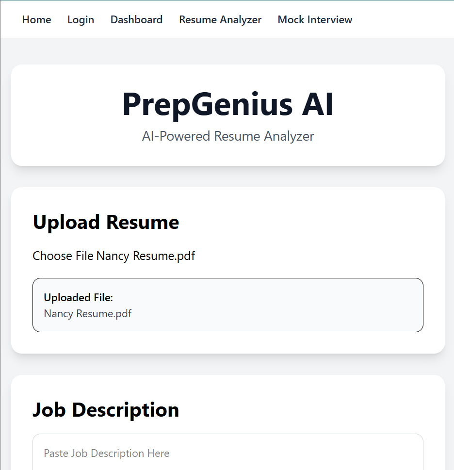
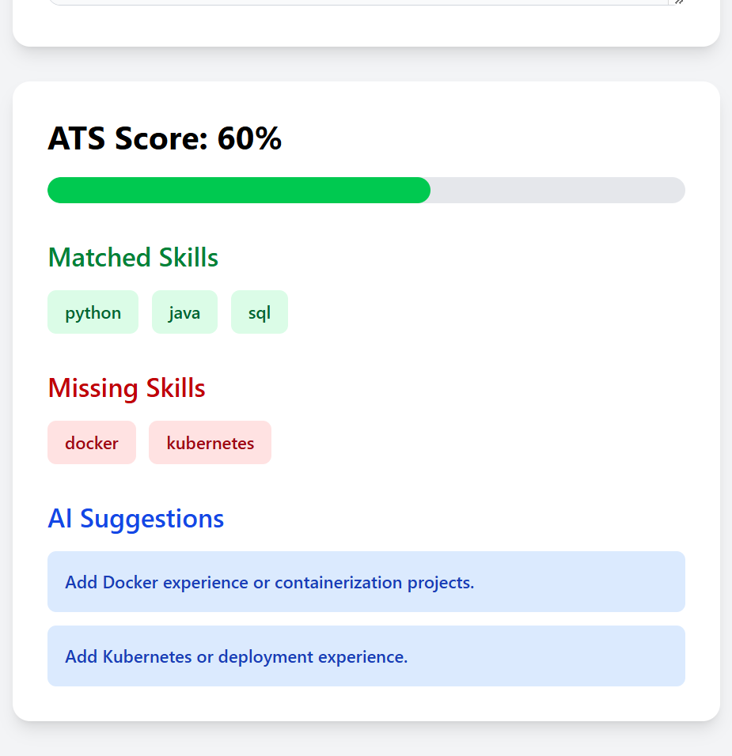
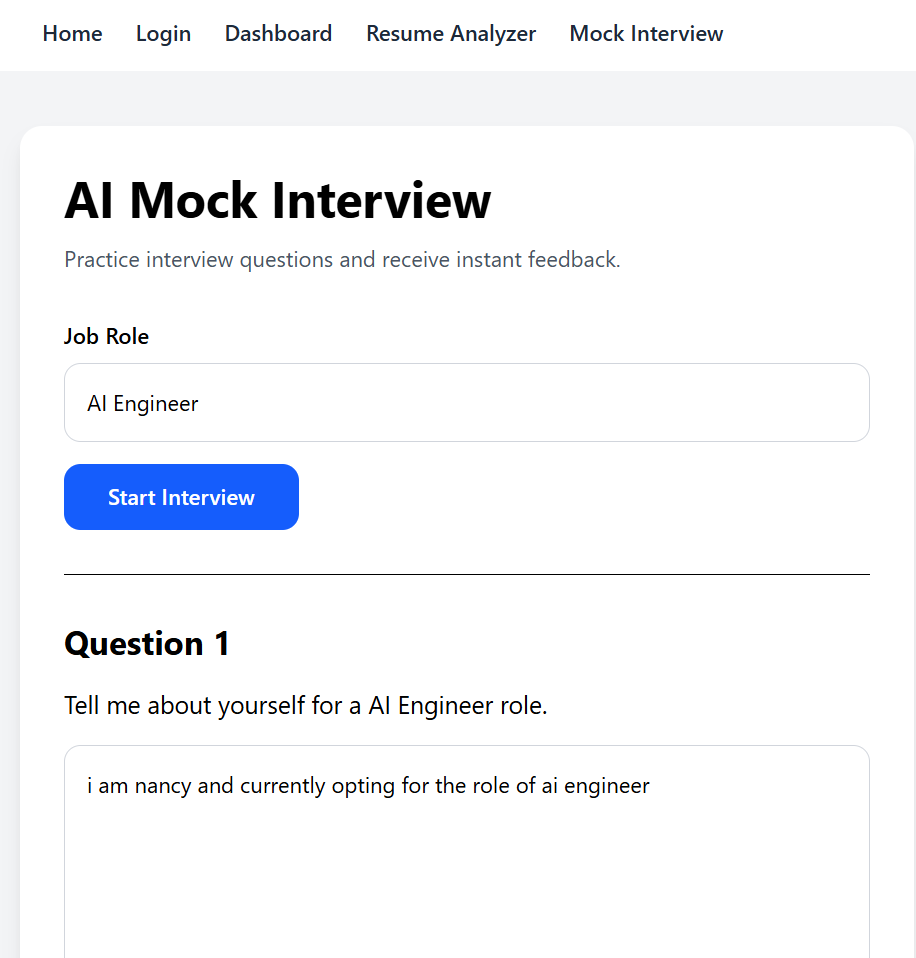

# PrepGenius AI

An AI-powered career preparation platform built using React and FastAPI.

## Features

* Resume PDF Upload
* Resume Text Extraction
* ATS Score Calculation
* Skill Gap Analysis
* AI Suggestions
* Mock Interview Module
* Interview Feedback & Scoring

## Tech Stack

### Frontend

* React
* Vite
* Tailwind CSS

### Backend

* FastAPI
* Python
* pdfplumber

### Tools

* Git
* GitHub
* VS Code

## Screenshots

### Home Page

### Resume Analyzer

### ATS Results

### Mock Interview

## Future Scope

* Gemini AI Integration
* Personalized Interview Questions
* Voice-Based Mock Interviews
* Resume Improvement Reports
* Job Recommendation Engine

## Author

**Nancy Khandelwal**

